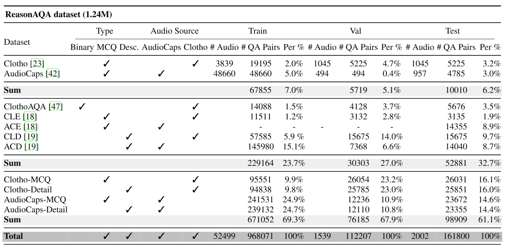

# Mellow: a small audio language model for reasoning
[[`Paper`](https://arxiv.org/abs/2503.08540)] [[`GitHub`](https://github.com/soham97/Mellow)] [[`Checkpoint`](https://huggingface.co/soham97/Mellow)] [[`Zenodo`](https://zenodo.org/records/15002886)]

Mellow is a small Audio-Language Model that takes in two audios and a text prompt as input and produces free-form text as output. It is a 167M parameter model and trained on ~155 hours of audio (AudioCaps and Clotho), and achieves SoTA performance on different tasks with 50x fewer parameters. 


## Index
* [Setup](#setup)
* [Usage](#usage)
* [Examples](#example)
* [ReasonAQA](#reasonaqa)
* [Limitation](#limitation)

## Setup
1. Install the required dependencies: `pip install -r requirements.txt`. For [conda](https://www.anaconda.com), run the following: 

```shell
cd Mellow && \
conda create -n mellow python=3.10.14 && \
conda activate mellow && \
pip install -r requirements.txt
```

2. To test the setup is complete, run:
```shell
python example.py
```

## Usage
The MellowWrapper class allows easy interaction with the model. To use the wrapper, inputs required are:
- `config`: The option supported is "v0"
- `model`: The option supported is "v0"
- `examples`: List of examples. Each example is a list containing three entries: audiopath1, audiopath2, prompt

Supported functions:
- `generate`: Produces text response for the given audio inputs and text prompt

## Example
Mellow supports open-ended questions-answering and can produce response based on the user's prompt. Below, we provide some example questions for testing Mellow on different tasks. 

```python
import torch
from pathlib import Path
import os
from mellow import MellowWrapper

# setup cuda and device
cuda = torch.cuda.is_available()
device = 0 if cuda else "cpu"

# setup mellow
mellow = MellowWrapper(
                    config="v0",
                    model = "v0",
                    device=device,
                    use_cuda=cuda,
                )

# pick up audio file paths
parent_path = Path(os.path.realpath(__file__)).parent
path1 = os.path.join(parent_path, "resource", "1.wav")
path2 = os.path.join(parent_path, "resource", "2.wav")

# list of filepaths and prompts
examples = [
    [path1, path2, "what can you infer about the surroundings from the audio?"],
    [path1, path2, "is there a cat in the audio? answer yes or no"],
    [path1, path2, "caption the audio."]
    [path1, path2, "Based on the audio, what can be said about the hypothesis - \"A farmer is giving a tour of his ranch while chickens roam nearby\"? a) It is definitely true b) It is definitely false c) It is plausible d) I cannot determine"],
    [path1, path2, "explain the difference between the two audios in detail."],
    [path1, path2, "what is the primary sound event present in the clip? a) dog barking b) chirping birds c) car engine d) clapping"],
]

# generate response
response = mellow.generate(examples=examples, max_len=300, top_p=0.8, temperature=1.0)
print(f"\noutput: {response}")
```

## ReasonAQA
The composition of the ReasonAQA dataset is shown in Table. The training set is restricted to AudioCaps and Clotho audio files and the testing is performed on 6 tasks - Audio Entailment, Audio Difference, ClothoAQA, Clotho MCQ, Clotho Detail, AudioCaps MCQ and AudioCaps Detail.


- The ReasonAQA JSONs can be downloaded from: [Zenodo](https://zenodo.org/records/15002886)
- The audio files can be downloaded from their respective hosting website: [Clotho](https://zenodo.org/records/4783391) and [AudioCaps](https://github.com/cdjkim/audiocaps)

## Limitation
With Mellow, we aim to showcase that small audio-language models can engage in reasoning. As a research prototype, Mellow has not been trained at scale on publicly available audio datasets, resulting in a limited understanding of audio concepts. Therefore, we advise caution when considering its use in production settings. Ultimately, we hope this work inspires researchers to explore small audio-language models for multitask capabilities, complementing ongoing research on general-purpose audio assistants.

## Citation
```

```
